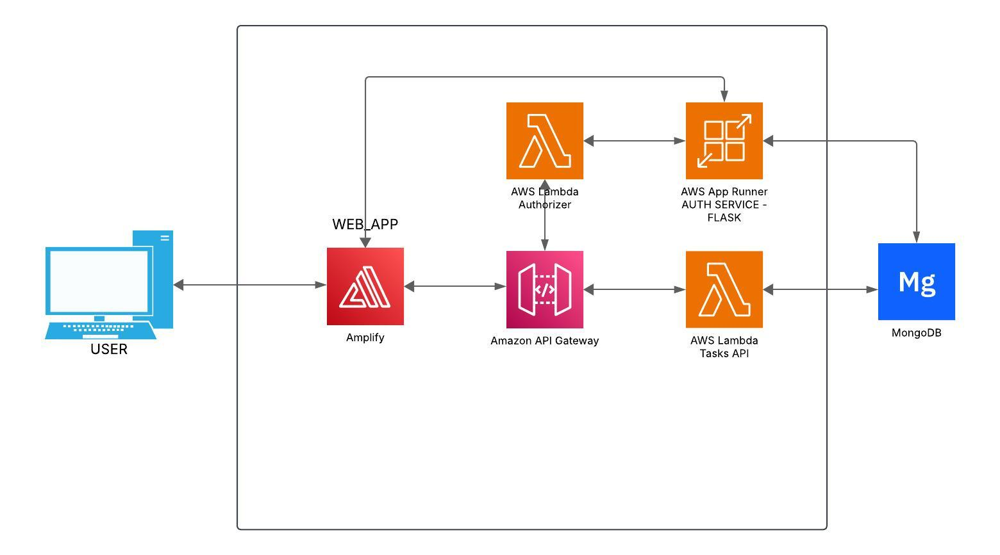
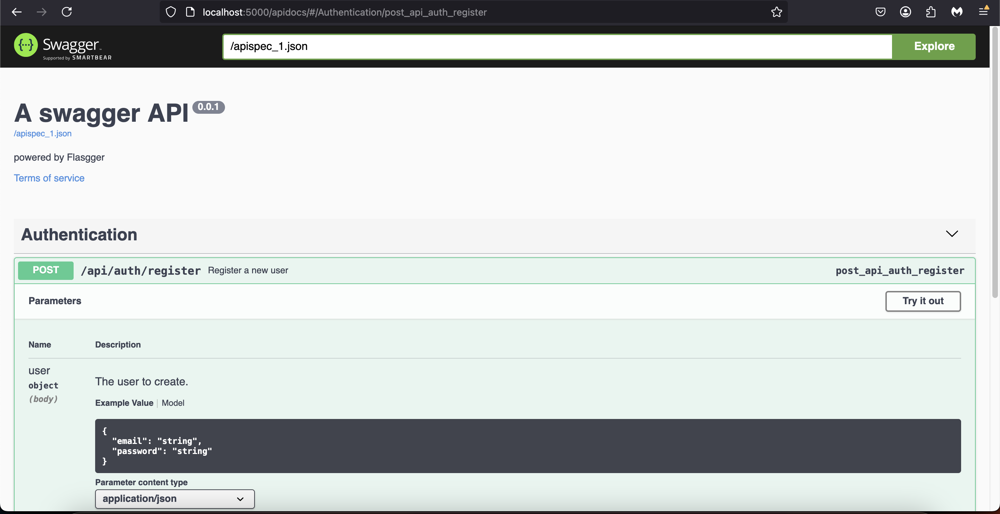

# tasks_crud
Full stack technical Assesment:

urls:
* serverles crud (tasks): https://g0214b2kx7.execute-api.us-east-1.amazonaws.com/dev
* authentication service: https://mubkk2mbsx.us-east-1.awsapprunner.com
* frontend: https://staging.d371lvcug8ni5n.amplifyapp.com/auth/login

## Architecture


The project is deployed on AWS:
* frontend: Its deployed on AWS Amplify<br>
* auth service: Its deployed on AWS App Runner<br>
* serverless crud: Its deployed on AWS Lambda<br>
* database: mongoDB<br>

For securing the serverless api, the api gateway endpoints have configured a lambda authorizer to validate that the request are from valid users

### Stack
Frontend: NextJS <br>
Auth Service: Flask<br>
Serverless Crud: Python<br>
Database: MongoDB<br>

## Documentation
Both api's have their OpenAPI specification with the definition of their endpoints. Due to the nature of the serverless api, there is not a way to document the api with swagger. But the auth service has integrated their defition in the docstring which is compatible with flassger


## Testing
On the serverless API, after activating the virtual enviroment, execute:
```
pytest tests/
```
## Monitoring
Both serverless and flask services have configured the logger to produce logs
